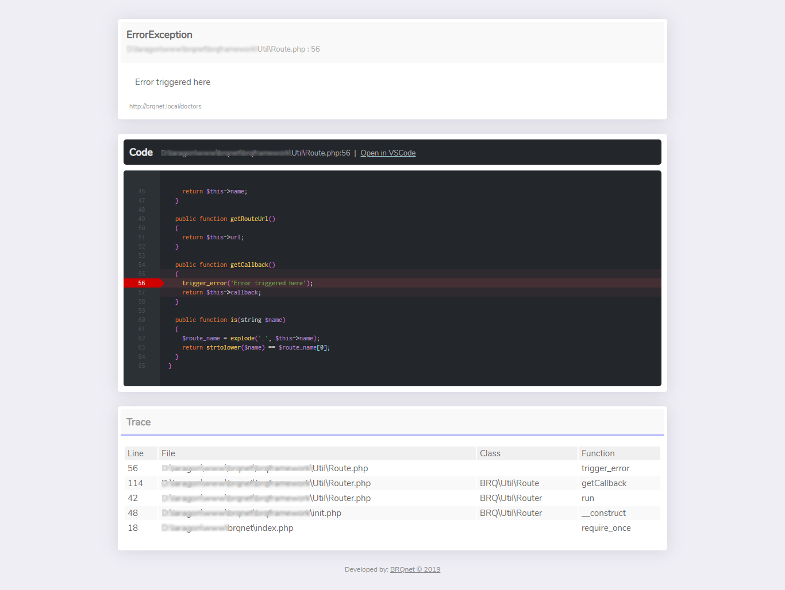

# Webby Beautiful Error Handler

PHP Error Handler
-----



**ErrorHandler** is an error handler class improved to work with Webby PHP Framework. 

It provides a pretty error interface that helps you debug your project.

## Usage

Currently it will not work with any PHP framework except Webby. If you want to use the original project, go to this url:

BrqErrorHandler [https://github.com/brqt/](https://github.com/brqt/)

### How it is used in Webby

It is called inside CodeIgniter.php found at 
/vendor/sylynder/framework/CodeIgniter.php 

```php
/*
 * ------------------------------------------------------
 *  Define a custom error handler so we can log PHP errors
 * ------------------------------------------------------
 */
set_error_handler('_error_handler');
set_exception_handler('_exception_handler');
register_shutdown_function('_shutdown_handler');

if (config_item('beautiful_error_handler')) {
	
	// Require Beautiful ErrorHandler
	require_once "ErrorHandler.php";

	// Use Beautiful Error Handler
	new ErrorHandler;
}

```

## License

MIT
